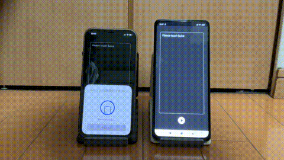
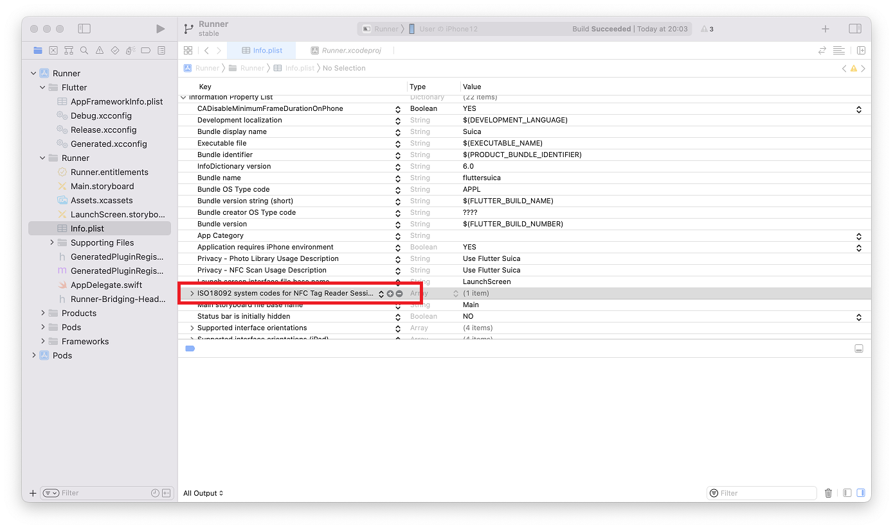
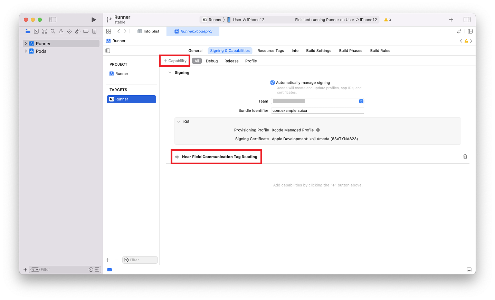

# Flutter Suica



# 環境
- Flutter 3.0
- nfc_manager 3.1.1

## Androidの権限

android/app/src/main/AndroidManifest.xml に追記
```
<uses-permission android:name="android.permission.NFC" />
```

## iOSの権限
 

- iOS はデベロッパー登録が必要（らしい）
- Info.plist に ISO 18092 system codes for NFC Tag Reader を追加 0003 を設定
- Signing & Capabilities に Near Field Communication Tag Reading を追加

## 実機でエラーが出るとき
```
nfc.platformexception(io_exception,null,null,null)
```
- リトルエンディアンに注意。
- start して stop しないとスマホ本体が変な状態になります。再起動してください。
- スマホ本体のNFCやおサイフケータイを有効にしてください。
- 一度に取得できるデータ数は12個で2回に分ける必要があります。

# Suica の読み取り実行結果

要求コマンドを送信すると16バイトのデータが返ってくるという流れです。

```
属性情報(008B)
00 00 00 00 00 00 00 00 32 00 00 B2 29 00 2E B1
```

```
利用履歴(090F) 最大20個
16 01 00 17 2D 64 8F 43 D9 52 B2 29 00 2E B1 A0
16 01 00 02 2D 64 FA B3 FA BE D4 2A 00 2E AF A0
1A 06 00 0E 2D 64 D9 52 D9 52 EC 2B 00 2E AD A0
C8 46 00 00 2D 63 5C 84 01 35 EC 2B 00 2E AB 00
C8 46 00 00 2D 62 A9 04 01 35 F4 2D 00 2E AA 00
16 01 00 17 2D 62 8F 43 D9 52 FC 2F 00 2E A9 A0
16 01 00 17 2D 62 D9 52 8F 43 1E 31 00 2E A7 A0
16 01 00 17 2D 61 8F 43 D9 52 40 32 00 2E A5 A0
16 01 00 17 2D 61 D9 52 8F 43 62 33 00 2E A3 A0
16 01 00 17 2D 5F 8F 43 D9 52 84 34 00 2E A1 A0
```

利用履歴の場合、日付が[04][05]で残高が[10][11]です。
<br>
<br>16 01 00 17 2D 64 8F 43 D9 52 B2 29 00 2E B1 A0
<br>
<br>日付[04][05] = 2D 64 = 年7bit月4bit日5bit = 22/11/4
<br>残高[10][11] = B2 29 = 0x29×256 + 0xB2 = 10674円
<br>となります。